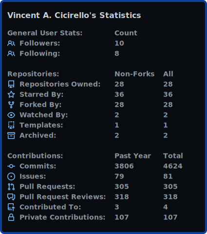

# user-statistician

[](#user-statistician)

Check out all of our GitHub Actions: https://actions.cicirello.org/

## About

[](https://github.com/marketplace/actions/user-statistician)
[](https://github.com/cicirello/user-statistician/actions/workflows/build.yml)
[](https://github.com/cicirello/user-statistician/actions/workflows/generate-samples.yml)
[](https://github.com/cicirello/user-statistician/actions/workflows/codeql-analysis.yml)
[](https://github.com/cicirello/user-statistician/blob/main/LICENSE)
[](https://github.com/cicirello/user-statistician)

The [cicirello/user-statistician](https://github.com/cicirello/user-statistician) GitHub 
Action generates a detailed visual summary of your activity on GitHub in the form of an SVG, 
suitable to display on
your [GitHub Profile README](https://docs.github.com/en/github/setting-up-and-managing-your-github-profile/customizing-your-profile/managing-your-profile-readme). 
Although the intended use-case is to generate an SVG image for your GitHub Profile README,
you can also potentially link to the image from a personal website, or from anywhere else
where you'd like to share a summary of your activity on GitHub. The SVG that the action 
generates includes statistics for the repositories that
you own, your contribution statistics (e.g., commits, issues, PRs, etc), as well as
the distribution of languages within public repositories that you own. 
The user stats image can be customized, including the colors such as with one
of the built-in themes or your own set of custom colors. You can also pick and choose
which sections of the card to include. 

The `user-statistician` action runs entirely here on GitHub. It uses the 
[GitHub GraphQL API](https://docs.github.com/en/graphql) to collect all of the
necessary data. The contribution counts are as reported by the GitHub GraphQL API.
For details of how GitHub counts contributions, see 
[GitHub's documentation](https://docs.github.com/en/github/setting-up-and-managing-your-github-profile/managing-contribution-graphs-on-your-profile/why-are-my-contributions-not-showing-up-on-my-profile).
The repository and contribution data included is all public. This is true even
of the "Private Contributions" entry on the stats image, as 
the "restrictedContributionsCount" returned from the query executed by the action 
will only be non-zero if you have opted in to sharing private contributions via 
[GitHub's profile settings](https://docs.github.com/en/github/setting-up-and-managing-your-github-profile/managing-contribution-graphs-on-your-profile/publicizing-or-hiding-your-private-contributions-on-your-profile). 
You can also hide the "Private Contributions" entry (see the 
[Inputs section](#inputs)) regardless of your GitHub settings, or any of the 
other entries. Each statistic will also auto-hide if the count is 0.

To use the `user-statistician` action, you just need to set up a workflow in your
profile repository (or technically any repository that you own) on a schedule (daily
should be sufficient), and then add a link to the image in your README. The action 
handles committing and pushing the generated image to the repository. If you
don't already have a GitHub Profile README, start by creating a public repository
with a name identical to your user name, and everything you include in the `README.md` of
that repository will show up on your GitHub Profile at the 
address: `https://github.com/USERNAME`.

__Motivation__: The reasons that we decided to create the 
[cicirello/user-statistician](https://github.com/cicirello/user-statistician)
GitHub Action, despite the availability of this other tool include the following:
1. We wanted to include more detailed stats all in a single SVG.
2. We wanted something that runs entirely within GitHub.
3. We wanted something that updated the SVG on a schedule (e.g., daily), 
  rather than on-demand, for the following reasons:
    * The SVG is simply served when requested, avoiding 
      the delay associated with waiting for API queries to gather the data to generate 
      the SVG. 
    * The API queries associated with generating the SVG happen once per 
      cycle of your configured schedule, regardless of how frequently your 
      profile is visited, decreasing system load.

__Show Your Support__: If you find the `user-statistician` action useful, 
please consider starring the repository; and if you use it for your profile 
README, please consider either linking the image to this repository, or 
otherwise sharing how it was generated with your profile visitors. 

## Table of Contents

The remainder of the documentation is organized into the following sections:
* [Example Workflows and Image Samples](#example-workflows-and-image-samples):
  This section includes workflows to get you started using the action, as well as
  sample images.
* [The Stats](#the-stats): This documents all of the statistics included in the
  SVGs that the action generates.
* [Inputs](#inputs): Documentation of all of the inputs to the action, their
  default values, and the effects they have on the behavior of the action.
* [Outputs](#outputs): Documentation of outputs of the action.
* [All Possible Action Inputs](#all-possible-action-inputs): This section provides
  a workflow that summarizes all of the action's inputs along with their default values.
* [Built With](#built-with): A list of the tools, etc used to develop this action.
* [Support the Project](#support-the-project): Ways that you can support the project.

## Example Workflows and Image Samples

This section provides example workflows demonstrating various features
of the action, as well as samples of the corresponding images that they generate.
If you would like to see a live example, in addition to the detailed examples
below, then you can check out [my GitHub profile](https://github.com/cicirello),
along with the corresponding [workflow](https://github.com/cicirello/cicirello/blob/master/.github/workflows/userstats.yml).

### Example 1: All default inputs

This first example uses all of the default inputs (see [Inputs](#inputs) section
for details of available inputs). Specifically, it uses the default color
theme (a light theme), and includes all available statistics in the image and
the default title. The action commits and pushes the image by default as well.

```yml
name: user-statistician

on:
  schedule:
    - cron: '0 3 * * *'
  workflow_dispatch:

jobs:
  stats:
    runs-on: ubuntu-latest
      
    steps:
    - uses: actions/checkout@v2

    - name: Generate the user stats image
      uses: cicirello/user-statistician@v1
      env:
        GITHUB_TOKEN: ${{secrets.GITHUB_TOKEN}}
```

This example workflow runs on a schedule (every day at 3am) and also includes
the `workflow_dispatch` event so that you can run it manually if desired.
See GitHub's documentation for details 
on [schedule syntax](https://docs.github.com/en/actions/reference/events-that-trigger-workflows#schedule)
and [workflow_dispatch](https://docs.github.com/en/actions/reference/events-that-trigger-workflows#workflow_dispatch).
The `actions/checkout@v2` step is required because the action generates the stats image
for the owner of the checked out repository, and it is also for the commit and push
functionality. Additionally, the `GITHUB_TOKEN` must be passed via an environment
variable to `cicirello/user-statistician` (see 
the `GITHUB_TOKEN: ${{secrets.GITHUB_TOKEN}}`) in order to be able to query 
GitHub's GraphQL API. The default permissions of the `GITHUB_TOKEN` are sufficient
for the API queries as well as (in most cases) for pushing the image to your 
repository. If you are running this in a repository with branch 
protection rules that require either reviews or checks, then see the section
below on [Protected branches with required checks](#protected-branches-with-required-checks).

The default behavior of the language distribution chart is to explicitly
list all languages that individually make up at least 1% of the code in your
public repositories, with low percentage languages combined into an "Other".
The language distribution chart is intended to be equivalent to the
language charts that GitHub generates for each repository, but by combining
all of the repositories that you own. 

Assuming that you use the default image filename and path, then you can
insert the image into your README with the following markdown:

```markdown

```

Although not required, it is appreciated if you instead link the image to this repository
so that others know how you generated it, with the following markdown:

```markdown
[](https://github.com/cicirello/user-statistician)
```

Here is a sample of what this will produce:

[](https://github.com/cicirello/user-statistician)

### Example 2: Dark theme without title

This example shows how to change colors to the
dark theme, as well as disabling the title.

```yml
name: user-statistician

on:
  schedule:
    - cron: '0 3 * * *'
  workflow_dispatch:

jobs:
  stats:
    runs-on: ubuntu-latest
      
    steps:
    - uses: actions/checkout@v2

    - name: Generate the user stats image
      uses: cicirello/user-statistician@v1
      with:
        colors: dark
        include-title: false
      env:
        GITHUB_TOKEN: ${{secrets.GITHUB_TOKEN}}
```

Here is a sample of what this will produce:

[](https://github.com/cicirello/user-statistician)

### Example 3: Dark-dimmed theme with custom title, some hidden stats, and including all languages in language distribution chart

This example shows the dark-dimmed theme, uses a custom title, includes all
languages in language distribution chart, and hides a
few statistics (followers, following, and private). Note by hiding both followers
and following that the action will automatically hide the header row for the
"General User Stats" section since we've hidden all of the non-zero 
stats from that section. If someone were to sponsor me, or if I was to
sponsor someone else, then the "General User Stats" section will show up the next time
generated since this sample didn't hide the sponsors or sponsoring counts.
If we want to guarantee that this entire section is hidden, we could instead
specify "general" among the "keys" we pass to `hide-keys`.

```yml
name: user-statistician

on:
  schedule:
    - cron: '0 3 * * *'
  workflow_dispatch:

jobs:
  stats:
    runs-on: ubuntu-latest
      
    steps:
    - uses: actions/checkout@v2

    - name: Generate the user stats image
      uses: cicirello/user-statistician@v1
      with:
        colors: dark-dimmed
        custom-title: My GitHub Statistics
        hide-keys: followers, following, private
        max-languages: 100
      env:
        GITHUB_TOKEN: ${{secrets.GITHUB_TOKEN}}
```

Here is a sample of what this will produce:

[](https://github.com/cicirello/user-statistician)

### Specific version vs major release

All of the above examples used the major release tag
for the `user-statistician` step 
(i.e., `uses: cicirello/user-statistician@v1`):

```yml
    - name: Generate the user stats image
      uses: cicirello/user-statistician@v1
      env:
        GITHUB_TOKEN: ${{secrets.GITHUB_TOKEN}}
```

The advantage to this is that you will automatically
get all non-breaking changes and bug fixes without the
need to alter your workflow. If you prefer to 
use a specific release, just use the SemVer of the
release that you wish to use, such as with the following:

```yml
    - name: Generate the user stats image
      uses: cicirello/user-statistician@v1.1.0
      env:
        GITHUB_TOKEN: ${{secrets.GITHUB_TOKEN}}
```

If you do use a specific release, then we recommend
configuring [GitHub's Dependabot](https://github.blog/2020-06-01-keep-all-your-packages-up-to-date-with-dependabot/)
in your repository.  Dependabot can be used to monitor dependencies,
including GitHub Actions, and generates automated pull requests to update
versions. The PRs it generates includes the text of release notes and ChangeLogs
giving you the opportunity to decide whether to upgrade the version.

### Protected branches with required checks

The default permissions of the `GITHUB_TOKEN` are sufficient for pushing
to a protected branch, provided that the branch protection hasn't been
configured with required reviews nor with required checks. If your
GitHub profile repository does have a branch protection rule with
required reviews or required checks, there are a couple solutions.

__Not Recommended:__ First, you could create a personal access token (PAT) 
with necessary permissions, save it as a repository secret, and use the PAT
with during the `actions/checkout` step 
(see [actions/checkout](https://github.com/actions/checkout)'s documentation). 
However, we do not recommend doing so.
If anyone else has write access to the repository, then they can potentially
create additional workflows using that PAT. This is probably reasonably safe
since it is probably rare to have collaborators on ones profile repository.
However, we still do not recommend this approach, as you must have had a reason
to put the required checks in place. If you decide to go this route anyway, note
that the `user-statistician` action will still only need the `GITHUB_TOKEN` and not
the PAT.

__Recommended:__ The second (and recommended) approach to dealing with a 
protected branch with
required checks is to set up a dedicated branch for generating the stats image.
This is actually what we are doing in this repository to generate the samples.
Our `main` branch is protected with required checks, after all this is a development
project repository and not a profile repository. We have a separate branch, `samples`,
that is protected, but does not have any required checks. The `GITHUB_TOKEN`
is sufficient to push to this branch.

Here is how you can do something similar if your profile repository has 
required checks on its main branch. First, create a branch, perhaps called `stats`.
The special `stats` branch does not need to be kept up to date with `main`. In fact,
once you create the `stats` branch, you can delete everything from that branch (e.g.,
you'll notice that the `samples` branch of this repository only has an "images"
directory). Next, create or modify a workflow in your `main` (or default) branch 
that checks out the dedicated `stats` branch (see the modified `actions/checkout@v2` 
step) as follows:

```yml
name: user-statistician

on:
  schedule:
    - cron: '0 3 * * *'
  workflow_dispatch:

jobs:
  stats:
    runs-on: ubuntu-latest
      
    steps:
    - uses: actions/checkout@v2
      with:
        ref: stats   # Or whatever you named your dedicated branch

    - name: Generate the user stats image
      uses: cicirello/user-statistician@v1
      env:
        GITHUB_TOKEN: ${{secrets.GITHUB_TOKEN}}
```

Since the image is now in a different branch than your README,
you also need to modify the markdown used to insert the
image into your profile README to refer explicitly to that branch
as follows:

```markdown

```

The repetition of "USERNAME" in the above example is that we are assuming this
is in your profile repository, which must be named identically to your username.

A version that links the image to this repository
so that others know how you generated it is as follows:

```markdown
[](https://github.com/cicirello/user-statistician)
```


## The Stats

The statistics displayed in the image are organized into categories. The stats
card can be customized to hide either individual statistics, or entire categories
if desired. Details of each category follows. Note that the "Key" is what you need if
you are using the `hide-keys` input to either hide individual statistics or 
entire categories (see the [Inputs](#inputs) section).

### General User Stats

The key to hide this entire category is: `general`. The statistics include the 
following.

| Key | Statistic | Details |
| --- | --- | ------ |
| `followers` | Followers | simple count |
| `following` | Following | simple count |
| `sponsors` | Sponsors | simple count |
| `sponsoring` | Sponsoring | simple count |

### Repositories

The Repositories category in the image includes
two columns with data summarizing information
about the non-forks that you own, as well as all repositories
that you own, including forks.
  
The key to hide this entire category is: `repositories`.
The statistics include the following.

| Key | Statistic | Details |
| --- | --- | ------ |
| `public` | Repositories Owned | simple count |
| `starredBy` | Starred By | simple count |
| `forkedBy` | Forked By  | simple count |
| `watchedBy` | Watched By | number watching your repositories (excluding you) |
| `templates` | Templates | number of your repositories that are templates |
| `archived` | Archived | number of your repositories that you have archived |

### Contributions

The Contributions category in the image includes
two columns with data summarizing information
about your contributions during the past year, as well as
totals over all years. Please note that this can be no more
accurate than what is available via GitHub's API. For example,
we have noticed that older contributions of our own seem to
be missing. Also keep in mind what GitHub specifically counts as contributions. 
For details of how GitHub counts contributions, see 
[GitHub's documentation](https://docs.github.com/en/github/setting-up-and-managing-your-github-profile/managing-contribution-graphs-on-your-profile/why-are-my-contributions-not-showing-up-on-my-profile).

The key to hide this entire category is: `contributions`.
The contributions statistics in the image include the following.

| Key | Statistic | Details |
| --- | --- | ------ |
| `commits` | Commits | simple count |
| `issues` | Issues | simple count |
| `prs` | Pull Requests | simple count |
| `reviews` | Pull Request Reviews | simple count |
| `contribTo` | Contributed To | number of repositories owned by others that you have contributed to |
| `private` | Private Contributions | number of private contributions if you have shared them via your GitHub settings |

Please note that GitHub's "restrictedContributionsCount" (which is your private contributions
count) doesn't distinguish the type of contributions, so we cannot simply add
these to the specific counts by type. 

### Language Distribution

The key to hide the language distribution section of the card is: `languages`.

The default behavior of the language distribution chart is to explicitly
list all languages that individually make up at least 1% of the code in your
public repositories, with low percentage languages combined into an "Other".
The language distribution chart is intended to be equivalent to the
language charts that GitHub generates for each repository, but by combining
all of the repositories that you own. The percentages are based on file sizes. 
You can also configure the number of languages to explicitly list
(see the [Inputs](#inputs) section).

Here are a few questions that we anticipate you might have:

__Why file sizes?__ Well, that is what GitHub
uses for the language charts within repositories, and that is the data that GitHub's
API makes available to us.

__Why are some of my languages missing?__ There are a variety of reasons that a 
language might not be represented. GitHub 
uses [Linguist](https://github.com/github/linguist) to detect the language
of each file in your repositories. There are several reasons that it might
exclude either individual files from the analysis, or entire languages. 
You can find the full list 
in [Linguist's documentation](https://github.com/github/linguist/blob/master/docs/how-linguist-works.md).
Among Linguist's default exclusions are languages classified as "data" and "prose",
as well as generated code, vendored code, and documentation. Some languages
that GitHub classifies as "data" are XML, JSON, GraphQL, among others.
Markdown is among the languages classified as "prose". To see how GitHub has
classified languages, look at 
[Linguist's languages.yml](https://github.com/github/linguist/blob/master/lib/linguist/languages.yml).

__Can I include languages that Linguist excludes?__ Yes, you can. GitHub's Linguist
enables you to [configure Linguist on a per-repository basis](https://github.com/github/linguist/blob/master/docs/overrides.md) 
via a `.gitattributes` file. In fact, we've done this very thing on this repository
to tell Linguist to include GraphQL (e.g., see our [.gitattributes](.gitattributes)).

__Can I exclude files or languages that Linguist includes?__ Yes, you can. With this, again
see [Linguist's override documentation](https://github.com/github/linguist/blob/master/docs/overrides.md). For example, Linguist
excludes documentation by default, but perhaps
you have documentation that is not in one of the paths that Linguist normally
treats as documentation. You can use your repository's `.gitattributes` file
to mark files or directories as documentation (likewise for vendored code, generated code,
etc). For an example of this, see the [.gitattributes of one of our other repositories](https://github.com/cicirello/Chips-n-Salsa/blob/master/.gitattributes) where we direct
Linguist to treat a directory as documentation.


## Inputs

All inputs include default values, and are thus optional provided the 
defaults are relevant to your use-case.

### `image-file`

The `image-file` input is the name of the file (including path relative to the 
root of the repository) for the user statistics image that is generated
by the action. It defaults to `image-file: images/userstats.svg`. The action
will create any directories that don't already exist, as necessary. The image is
an svg.

### `include-title`

The `include-title` controls whether or not the user statistics card 
includes a title. It defaults to `true`. If you'd rather not have a 
title in the image, then just pass `include-title: false` (actually, anything
other than `true`, case insensitive, will be treated as `false`).

### `custom-title`

If you include a title in the user statistics image, the default 
title is of the form "Your Name's GitHub Activity", where "Your Name" is the 
public name of the owner of the repository that is using the action.
Although note that in the case where the API query returns a null name,
then the fallback behavior is to use the user id in its place.

You can customize the title using the `custom-title` input. For example,
`custom-title: Hello GitHub` will set the title accordingly. Be aware that
the image width is fixed, and is not resized based on title length. Note that
if you pass a custom title with the `custom-title` input and also pass
`include-title: false`, then the conflicting input values will be resolved in
favor of the `include-title: false`.

### `small-title`

This input controls the font size of the title. The default is `small-title: false`,
which is a font size of 18px (the font size of the rest of the text in the SVG is 14px).
The default should be a good choice in most cases. However, depending upon the
length of a custom title, or if you use the default title but have a long name, then the 
title may overflow the viewbox of the SVG. In a case like this, you can pass
`small-title: true`, which will decrease the font size of the title to 16px.

### `max-languages`

This input is the maximum number of languages to explicitly include in 
the language distribution chart. The default is `max-languages: auto`, which
will explicitly show all languages that make up at least 1% of the code in your
public repositories (excluding forks). All other languages will be combined
into an "Other". You can also specify the number of languages explicitly. 
For example, `max-languages: 5` will explicitly include the 5 languages with the
highest percentages, and will then combine all other languages into an "Other".
Although if your repositories contain 5 or less languages, then "Other" will
not be listed.  If you want to explicitly include all languages that occur
in your repositories, then just pass a high integer value, such as with
`max-languages: 100`.

### `colors`

The `colors` input enables you to either select from a set of
built-in color themes, or to define your own set of custom colors.
At the present time, there are three built-in themes: `light`, `dark`, and
`dark-dimmed` that are based on GitHub's color palette and themes of the
same names. If you want to know the specific colors used in each of these,
see the source in [src/Colors.py](src/Colors.py). Also see 
the [Example Workflows and Image Samples](#example-workflows-and-image-samples)
section of this readme for a few samples.

The default is `colors: light`. You can change to a different color theme
by just passing its name (e.g., `colors: dark`).

If you have a specific set of colors that you'd like to instead use, you
can pass a list of colors (space or comma separated). The list should include
at least 4 colors in the following order: background color, border color, 
icon color, title color, and (optionally) text color. If only 4 colors are specified,
then all text will use the title color. If you pass more than 5 colors, the extras
are ignored. If you pass less than 4 colors, then the default `light` theme will
be used.  Here is an example: `colors: '#f6f8fa #c8e1ff #0366d6 #24292e #24292e'`.
This example happens to be the `light` theme. Because `#` has special meaning to 
YAML (it is used for comments), you must either put quotes around the input value 
as shown in this example, or you can escape each `#` individually. The colors in this 
list can be specified either with hex (as in the example above), or with any 
named colors that are recognized by SVG, or some combination of the two. Here is an 
example with named colors: `colors: black yellow green white white`. Notice that you 
don't need quotes around the input if none of the colors are specified by hex.

__The action does not do any validation of the colors that you pass.__ If you pass
invalid color names or invalid hex color values, then the image generated will be
incorrect. The color values that you specify are inserted verbatim into the appropriate
places within the SVG.

### `border-radius`

This input is the radius of the border of the SVG. The default is `border-radius: 6`.

### `show-border`

This input controls whether or not the SVG has a border. The default is `true`.

### `hide-keys`

The action automatically hides any statistics with a value of 0. For example,
if you have no pull requests, the action automatically will hide the pull requests
entry from the image rather than listing it as 0. Otherwise, all supported statistics
are shown by default. If you wish to hide any regardless of whether it has a value of 0, 
then just pass a list of the "keys" corresponding to those you want to hide. 
The list can be either space or comma separated.
If you want to hide an entire group, including the relevant column headings, then you
can pass the "key" for the category itself. Alternatively, if you
list all of the keys for the elements
of that group, then the entire group, including column headings, will be hidden. 
For example, `hide-keys: followers following sponsors sponsoring private` will hide
the "Followers", "Following", "Sponsors", and "Sponsoring" counts from 
the "General User Stats" section, and thus will also eliminate the column 
headings for that entire section, and this will
also hide the "Private Contributions" item from the "Contributions" section.
Another way of accomplishing the same thing is to use the "key" for the category
such as: `hide-keys: general private`. 

See earlier in the section [The Stats](#the-stats) for the keys needed for this input.
The keys are case sensitive.

### `locale`

This input is an ISO 639-1 two character language code for the
language used in names of statistics, section and column headings,
and default title on the user stats card. The default is `locale: en`,
which is English. At the present time, this is the only supported 
locale, but we anticipate introducing support for additional languages.
If an unsupported locale is passed, then the action will use the
default of "en".

If you are interested in contributing a new locale, only the 
[src/StatConfig.py](src/StatConfig.py) file must be updated. See the comments
within that file for guidance in contributing a locale.

### `fail-on-error`

This input enables you to control what happens if the
action fails for some reason (e.g., error communicating
with the GitHub GraphQL API, etc). Note that in all of
our testing so far, this has not happened yet. But as software
developers, we all know that anything that can go wrong, will
go wrong eventually.

The default is `fail-on-error: true`, which means that if
an error occurs it will cause the workflow to fail. The rationale
for this default is that the failed workflow will lead to a
GitHub notification so that you know something went wrong.
If you'd rather just let it quietly fail, to most likely correct
itself during the next run, then pass `fail-on-error: false`
(actually anything other than `true` will be treated as `false`).

### `commit-and-push`

The `commit-and-push` input controls whether the action commits
and pushes the generated image upon creation. It defaults to
`commit-and-push: true`. If the user stats image has changed since
last commit, then as long as you are not running this in a detached
head state (such as on a pull request event), the action will commit
and push the new user stats image. If you are in a detached head
state, such as if you were to run this during a pull request 
(not sure why you would), then the action will simply and quietly
skip the commit/push without issuing an error. 

If your branch is protected with either required reviews or required
checks, then the push will fail with an error. Whether this also
fails your workflow depends on how you have set 
the `fail-on-error` input. See the earlier discussion for what you 
can do if you wish to use the action in a repository with
that has configured required reviews or required checks:
[Protected branches with required checks](#protected-branches-with-required-checks).

The author of the commit is set to the github-actions bot.

## Outputs

The action has only the following action output variable.

### `exit-code`

If the input `fail-on-error` is set to `false`, then in addition to
quietly failing (i.e., not failing the workflow run), the output `exit-code`
will be set to a non-zero exit code that may be useful in debugging the
issue. If the input `fail-on-error` is set to `true` (the default), your
workflow run won't have the opportunity to check the `exit-code` output.
However, the `exit-code` and a descriptive error message will still be
logged in the workflow output. In either case, if you believe that the
failure is a bug, please include this in any bug reports.


## All Possible Action Inputs

The workflow here shows all possible inputs, with their default
values, and also shows how to access the action's `exit-code`
output if desired.

```yml
name: user-statistician

on:
  schedule:
    - cron: '0 3 * * *'
  workflow_dispatch:

jobs:
  stats:
    runs-on: ubuntu-latest
      
    steps:
    - uses: actions/checkout@v2

    - name: Generate the user stats image
      id: statsStep # Only needed if you want to check the exit-code
      uses: cicirello/user-statistician@v1
      with:
        image-file: images/userstats.svg
        include-title: true
        custom-title: '' # Defaults to title pattern described earlier
        small-title: false
        max-languages: auto
        colors: light
        border-radius: 6
        show-border: true
        hide-keys: '' # None hidden
        locale: en
        fail-on-error: true
        commit-and-push: true
      env:
        GITHUB_TOKEN: ${{secrets.GITHUB_TOKEN}}

    - name: Check exit code if desired
      run: |
        # Note that if you set fail-on-error to true, you'll
        # never actually get here if an error occurs. But if you
        # set fail-on-error to false, then instead of failing the
        # workflow, the action will output the exit code that would
        # have failed the workflow and you can check it here.
        echo "exitCode = ${{ steps.statsStep.outputs.exit-code }}"
```

## Built With

The `user-statistician` action uses the following:
* Python 3 (implemented almost entirely in Python);
* The [cicirello/pyaction:4](https://github.com/cicirello/pyaction) Docker 
  image, which includes the GitHub CLI installed on a python:3-slim base image;
* [The GitHub CLI](https://cli.github.com/);
* [GitHub GraphQL API](https://docs.github.com/en/graphql);
* [GitHub Octicons](https://github.com/primer/octicons) for the icons in the stats image; and
* We started with our template repository for GitHub Actions implemented in 
  Python: [cicirello/python-github-action-template](https://github.com/cicirello/python-github-action-template).

## Support the Project

You can support the project in a number of ways:
* __Starring__: If you find the `user-statistician` action useful, consider starring the
  repository.
* __Linking or Sharing__: If you use it to generate an SVG for your 
  GitHub Profile README, consider
  either linking the image back to this repository, or otherwise sharing
  how you generated the stats SVG.
* __Sponsoring__: You can also consider 
  [becoming a sponsor](https://github.com/sponsors/cicirello).

## License

This GitHub action is licensed under the [MIT License](LICENSE.md). If you contribute
to the project, you agree that your contributions are likewise licensed through
the MIT License. 

